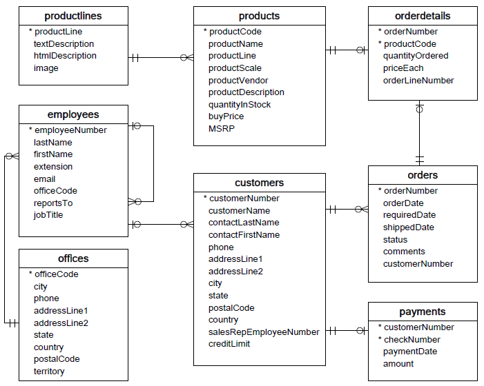
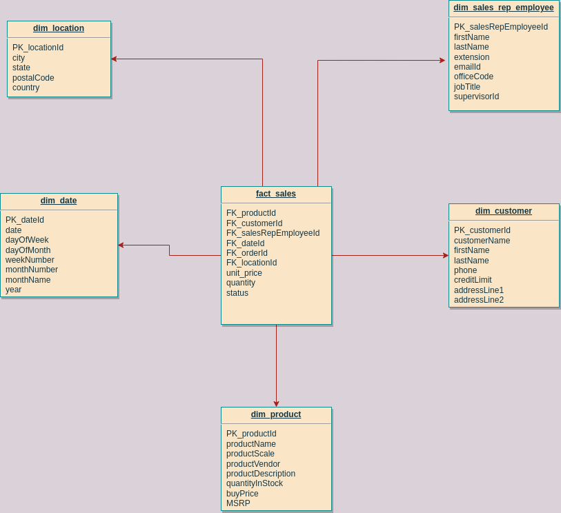

# retail-data-project

Export data from mysql-database to REDSHIFT using pyspark

Problem Statement:
We need to build an ETL pipeline to dump mysql data base record to redshift by doing necessary transformations using spark 
so that we can perform analytical queries to create Analysis reports,dashboards and Machine Learning Models for predictions.

We will design Star Schema so that we can export above attached OLTP to OLAP

OLTP Design


RedShift Dataware house(OLAP Design)


Approach
1. Read data from mysql using pyspark and perform transformations to create OLAP from OLTP and then dump it in S3 bucket

2. Read data from s3 bucket and dump in REDSHIFT and perform Analytical Queries
  

3. We can Create KPI Reports using this data,Sales Dashboards or build Machine Learning Models.
Launch entire server setup
```

Below are requirements to be need to run this project

mysql-connector-j-8.0.32

'''
conda install -c cyclus java-jdk
'''
Pyspark library and its functions
'''
pip install pyspark

from pyspark.sql import SparkSession
from pyspark.functions import *
from pyspark.types import *
'''
Libraries needed for dumping data into s3
'''
from io import StringIO
import boto3
import pandas
'''

